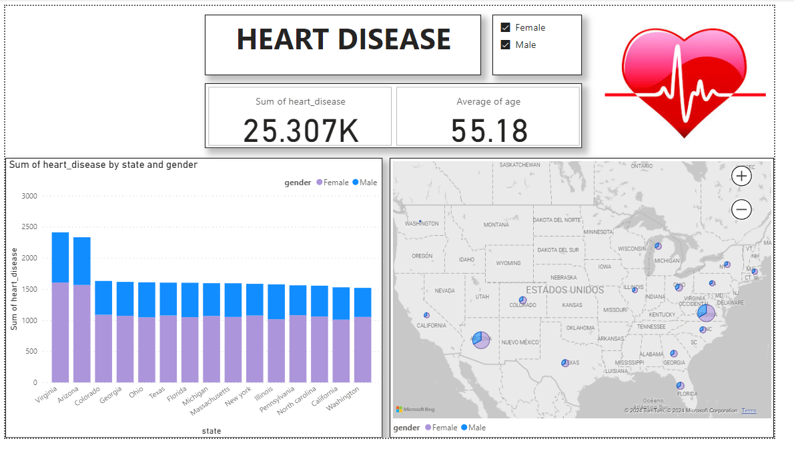

# Case Study
In this repository you will the solution to the proposed case study on healthcare data. All the code is on the repo.

## ETL 
The ETL phase was developed using the pandas library.
### Extract 
Read the data from an excel file. 
```python
def extract(filepath) -> pd.DataFrame:
    return pd.read_excel(filepath)
```
### Transform
The transformation part took care of the multiple date types available in the *day_of_birthday* column, mitigate the encoding issue present in the *state* column and standarization of the *gender* column.
```python
def encoding_transformation(s):
    """
    Handle encoding issues.
    inputs:
        s (str) -> bad encoding/decoding string. i.e  -> Arizóna
    outputs:
        utf8_s -> well decoded string. i.e -> Arizona
    """
    s = str(s).encode('ISO-8859-1').decode()
    n_s = ud.normalize('NFKD', s)
    r_a = n_s.encode('ascii', errors='ignore')
    utf8_s = r_a.decode('utf-8').lower().capitalize()
    return utf8_s

def gender_transformation(s):
    """
    Gender number standards.
        The four codes specified in ISO/IEC 5218 are:
        0 = Not known;
        1 = Male;
        2 = Female;
        9 = Not applicable.
    inputs:
        s (str) -> 1,2,male,fema
    outputs
        'Male' or 'Female' or 'Not known'
    """
    s = str(s).lower()
    if s in ('1', 'male'):
        return 'Male'
    elif s in ('2', 'fema'):
        return 'Female'
    else:
        return 'Not known'

def transformation_dates(df, col):
    logger.info('Parsing multiple date formats.')
    df[col] = pd.to_datetime(df[col])
    df[col] = df[col].dt.strftime('%Y-%m-%d')
    return df
```
I've used a feature of pandas called pipes to perform the transformations in a sequence.
```python
curated_df = (df
              .pipe(transformation_dates, col='day_of_birthday')
              .pipe(transformation_encoding, col='state')
              .pipe(transformation_gender, col='gender')
              )
```
### Load
The load was done in batches of 5k records and to make the pipeline idempotent I perform a truncate table command before inserting the data.
```python
def load(df, tablename, schema) -> bool:
    conn_url = URL.create("mssql+pyodbc", query={"odbc_connect": os.getenv('conn_str')})
    engine = create_engine(conn_url)
    with engine.connect() as connection:
        connection.execute(text(f'TRUNCATE TABLE {schema}.{tablename}'))
        result = df.to_sql(tablename,con=connection, schema=schema, if_exists='append', chunksize=5000, index=False)
    return result != None
```
The data was loaded to a free instance of **Azure SQL Database**.

## SQL
The table DDL is the following, I tried to use the most accurate data types depending on the type of data available in the dataframe.
```sql
CREATE TABLE [healthcare].[health_data](
	[age] [bigint] NULL,
	[gender] [varchar](max) NULL,
	[chest_pain_type] [bigint] NULL,
	[resting_blood_pressure] [bigint] NULL,
	[cholesterol] [bigint] NULL,
	[fasting_blood_sugar] [bigint] NULL,
	[resting_ecg_results] [bigint] NULL,
	[max_heart_rate] [bigint] NULL,
	[exercise_induced_angina] [bigint] NULL,
	[st_depression] [float] NULL,
	[st_slope] [bigint] NULL,
	[num_major_vessels] [bigint] NULL,
	[thalassemia] [bigint] NULL,
	[heart_disease] [bigint] NULL,
	[day_of_birthday] [date] NULL,
	[state] [varchar](max) NULL
);
```
I was really busy in my current job so I just create 3 queries.
### Percentage of patients with heart disease grouped by gender
```sql
WITH gender_total_disease AS (
    SELECT 
        gender,
        count(*) total_disease
    FROM healthcare.health_data 
    WHERE heart_disease = 1  
    GROUP BY gender
),
gender_total_count AS (
    SELECT
        gender,
        count(*) total_count
    FROM healthcare.health_data
    GROUP BY gender
)
SELECT
    a.gender,
    CAST((a.total_disease*1.0 / b.total_count) * 100 AS decimal(4,2)) as gender_disease_pct
FROM
    gender_total_disease a
JOIN
    gender_total_count b ON a.gender = b.gender;
```
### Patients with heart disease grouped by aging group
I've created a new column called agegroup to group the ages in groups of 10 years starting in age 30.
```sql
WITH age_grouping AS (
    SELECT
        *,
        CASE
            WHEN age < 30 then 'under 30'
            WHEN age < 41 then '30 - 40'
            WHEN age < 51 then '40 - 50'
            WHEN age < 61 then '50 - 60'
            WHEN age < 71 then '60 - 70'
            else 'over 70'
        END as AGEGROUP
    FROM healthcare.health_data
)
SELECT
    AGEGROUP,
    COUNT(*) patients_with_disease
FROM
    age_grouping
WHERE
    heart_disease = 1
GROUP BY
    AGEGROUP
```
### Typical resting electrocardiogram results on patients with disease and age between 30 and 40
```sql
SELECT
    TOP 1 '40 - 50' agegroup, resting_ecg_results
FROM
    healthcare.health_data
WHERE
    heart_disease = 1 AND age BETWEEN 40 AND 50
GROUP BY
    resting_ecg_results
ORDER BY COUNT(*) DESC;
```

## Visualization
I've created a dashboard in Power BI in which we can filter the data by gender, then see the number of patients with heart disease by state in US and also the age average.

